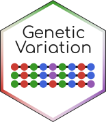

#  GeneticVariation

[](https://github.com/BioJulia/GeneticVariation.jl/releases/latest)
[](https://github.com/BioJulia/GeneticVariation.jl/blob/master/LICENSE)
[](https://biojulia.github.io/GeneticVariation.jl/stable)
[](https://biojulia.github.io/GeneticVariation.jl/latest)


## Description

GeneticVariation provides types and methods for working with datasets of genetic
variation. It provides a VCF and BCF parser, as well as methods for working with
variation in sequences such as evolutionary distance computation, and counting
different mutation types.


## Installation

Install GeneticVariation from the Julia REPL:

```julia
using Pkg
add("GeneticVariation")
```

If you are interested in the cutting edge of the development, please check out
the master branch to try new features before release.


## Testing

GeneticVariation is tested against julia `1.X.Y` on Linux, OS X,
and Windows.

| **PackageEvaluator** | **Latest Build Status** |
|:--------------------:|:-----------------------:|
|  [](http://pkg.julialang.org/?pkg=GeneticVriation) |  [](https://travis-ci.org/BioJulia/GeneticVariation.jl) [](https://ci.appveyor.com/project/Ward9250/geneticvariation-jl) [](https://codecov.io/gh/BioJulia/GeneticVariation.jl)


## Contributing

We appreciate contributions from users including reporting bugs, fixing
issues, improving performance and adding new features.

Take a look at the [CONTRIBUTING](CONTRIBUTING.md) file provided with
every BioJulia package package for detailed contributor and maintainer
guidelines.


### Financial contributions

We also welcome financial contributions in full transparency on our
[open collective](https://opencollective.com/biojulia).
Anyone can file an expense. If the expense makes sense for the development
of the community, it will be "merged" in the ledger of our open collective by
the core contributors and the person who filed the expense will be reimbursed.


## Backers & Sponsors

Thank you to all our backers and sponsors!

Love our work and community? [Become a backer](https://opencollective.com/biojulia#backer).

[](https://opencollective.com/biojulia#backers)

Does your company use BioJulia? Help keep BioJulia feature rich and healthy by
[sponsoring the project](https://opencollective.com/biojulia#sponsor)
Your logo will show up here with a link to your website.

[](https://opencollective.com/biojulia/sponsor/0/website)
[](https://opencollective.com/biojulia/sponsor/1/website)
[](https://opencollective.com/biojulia/sponsor/2/website)
[](https://opencollective.com/biojulia/sponsor/3/website)
[](https://opencollective.com/biojulia/sponsor/4/website)
[](https://opencollective.com/biojulia/sponsor/5/website)
[](https://opencollective.com/biojulia/sponsor/6/website)
[](https://opencollective.com/biojulia/sponsor/7/website)
[](https://opencollective.com/biojulia/sponsor/8/website)
[](https://opencollective.com/biojulia/sponsor/9/website)


## Questions?

If you have a question about contributing or using BioJulia software, come on over and chat to us on [the Julia Slack workspace](https://julialang.slack.com/channels/biology), or you can try the [Bio category of the Julia discourse site](https://discourse.julialang.org/c/domain/bio).
